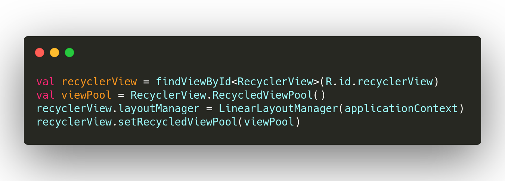
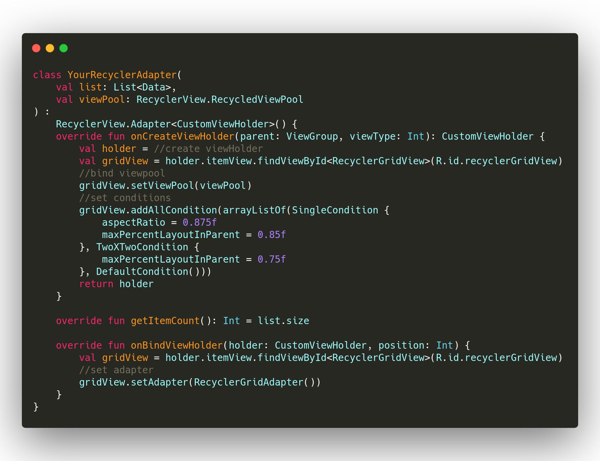
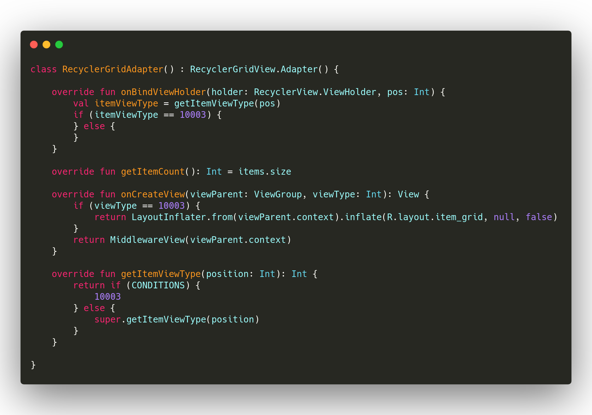

# RecyclerGridView

 


RecyclerGridView is an nine gridlayout.

* support in RecyclerView with RecyclerPool
* good performance(with RecyclerView pool)
* support multiple type
* flexable

### gradle

````groovy
implementation 'io.github.keep2iron:recyclergridview:$last_version'
````

### preview

sample code in **app** project.


### core class

- **Condition.kt**

  it can let RecyclerGridView know how to layout.overload some method you can change the show style.

  |     Method/Property      |                            Effect                            |
  | :----------------------: | :----------------------------------------------------------: |
  |        maxColumn         |             column count ,**default value is 9**             |
  |       aspectRatio        |       single item aspect ratio,**default value is 1f**       |
  | maxPercentLayoutInParent | controll the total width proportion in layout,**default value is 9** |
  |       maxShowCount       |         max count,**more than it does not display**          |
  |  weatherConditionApply   |             return true above of al will effect              |

  Default implementation

  **SingleCondition**,it will work in a single image.

  **FourXFourCondition**,it will work in **four count image**.

  

### usage

1.init RecyclerView with ViewPool



2.Create your RecyclerView Adapter and bind viewPool



3.create RecyclerGridAdapter,you can set multiple type view,if you want to add multiple you can follow this way.

**getItemViewType() return defualt type must call super.getItemViewType()**

